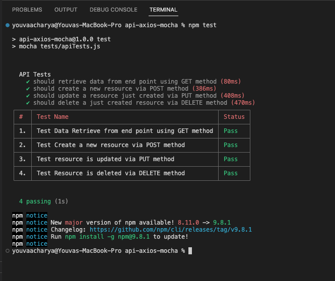

# API Test Automation with Mocha Js

This is a test automation framework for API testing with JavaScript, utilizing Mocha Test and Axios for efficient testing

## Description

This test automation framework is built entirely in pure JavaScript, utilizing the Axios library for making HTTP requests, and harnessing the combined power of Chai and Mocha as the core testing framework. Designed for seamless API testing, it empowers testers and developers to create, manage, and execute tests efficiently. It employs the cli-tables3 library to generate clear and simple test results at the end of each execution.

## Getting Started

### Dependencies

- Ensure you have node js installed v16+ is preferred
- Project uses following npm packages.
  - Axios - Promise based HTTP client for the browser and node js
  - Chai - assertion library for node.js and the browser.
  - mocha - Simple, flexible , test framework
  - cli-table3 - pretty unicode tables for the command line

These are already added in package.json. Go directly to # Installing

### Installing

- Go to the root folder in command line and run the following command.
  ```
  npm install
  ```

### Configuration

- For the demo we are using reqres.in ( A hosted REST-API ready to respond) site for testing.
- You can go ahead and change the API end point and updated your base api url at config/config.js

```
module.exports = {
apiUrl: 'https://reqres.in/api/users',
}

```

### Executing program

- Go to the root folder in terminal and run the command

```
npm test
```

## Screenshot

Once the test execution done you shoudl see the following in your terminal.



## Authors

Youva Acharya\
youvaraj@gmail.com
